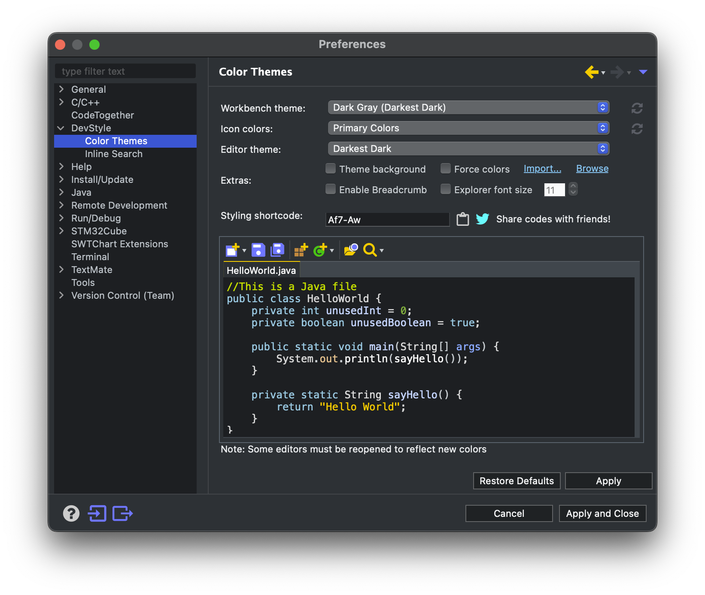

# 实验5指南

!!! danger "本实验指南尚未发布，内容随时可能发生变化"

<!-- <div style="display:none"> -->

请跟随实验指南完成实验，完成文档中所有的`TASK`。`BONUS`部分的内容完成可作为加分，但报告的总分不应超过100分。请下载此指南作为实验报告模版，将填充完成的实验报告导出为PDF格式，并命名为“学号_姓名_lab5.pdf”，上传至学在浙大平台。下载请点击 **<u>[这里](../download.md)</u>** 。

由于本实验较为复杂，涉及到较多新硬件，硬件整体连线部分将靠后讲解，可先在之前完成基本的芯片配置，在后续实验中逐步配置其余引脚等。

## 1 FreeRTOS

FreeRTOS 由美国的 RichardBarry 于2003年发布，RichardBarry是 FreeRTOS 的拥有者和维护者，在过去的十多年中 FreeRTOS 历经了9个版本，与众多半导体厂商合作密切，有数百万开发者，是目前市场占有率最高的 RTOS.

FreeRTOS 于2018年被亚⻢逊收购，改名为 AWSFreeRTOS，版本号升级为 V10，且开源协议也由原来的 GPLv2+ 修改为 MIT.

### 1.1 FreeRTOS 的任务状态

FreeRTOS 的任务状态及其转换关系如下图所示：


### 1.2 FreeRTOS 的任务优先级

- 每个任务都要被指定一个优先级，从`0` ~ `configMAX_PRIORITIES`， `configMAX_PRIORITIES` 定义在 `FreeRTOSConfig.h` 中

- 如果某架构硬件支持CLZ，将 `FreeRTOSConfig.h` 中  `configUSE_PORT_OPTIMISED_TASK_SELECTION` 设置为1，并且最大优先级数目 `configMAX_PRIORITIES` 不能大于32

- 低优先级数值代表低优先级。空闲任务(idle task)的优先级为0（`tskIDLE_PRIORITY`）

- 任何数量的任务可以共享同一个优先级。如果宏 `configUSE_TIME_SLICING` 未定义或着宏 `configUSE_TIME_SLICING` 定义为1，处于就绪态的多个相同优先级任务将会以时间片 切换的方式共享处理器

### 1.3 FreeRTOS 任务相关函数

在本指南中，仅介绍实验中可能会用到的函数以及其他较为常见的函数，更具体的API引用见 **<u>[官方文档](https://www.freertos.org/zh-cn-cmn-s/a00106.html)</u>** 

#### 1.3.1 任务创建函数

```c
TaskHandle_t xTaskCreate(
    TaskFunction_t pvTaskCode,           // 任务函数
    const char * const pcName,           // 任务名
    configSTACK_DEPTH_TYPE usStackDepth, // 任务栈大小
    void * const pvParameters,           // 任务参数
    UBaseType_t uxPriority,              // 任务优先级
    TaskHandle_t * const pvCreatedTask   // 任务句柄
);
```

- usStackDepth以字⻓为单位

- pvCreatedTask带回任务的id，之后要用这个id来表示任务

#### 1.3.2 任务函数

```c
void vATaskFunction( void *pvParameters )
{
    for( ;; )
    {
        /*-- 应用程序代码放在这里. --*/
    }

    /* 任务不可以从这个函数返回或退出。在较新的FreeRTOS移植包中，如果
    试图从一个任务中返回，将会调用configASSERT()(如果定义的话)。
    如果一个任务确实要退出函数，那么这个任务应调用vTaskDelete(NULL)
    函数，以便处理一些清理工作。*/

    // vTaskDelete( NULL );
}
```

#### 1.3.3 空闲任务和空闲任务钩子

- 空闲任务是FreeRTOS内核的一部分，它的优先级最低，当没有其他任务可运行时，空闲任务将会运行

- 删除任务后，空闲任务用来释放RTOS分配给被删除任务的内存
- 应用程序任务共享空闲任务优先级（`tskIDLE_PRIORITY`）也是可能的
- 空闲任务钩子是一个函数，每一个空闲任务周期被调用一次
`void vApplicationIdleHook( void )`;

#### 1.3.4 任务延时

##### 相对延时函数

```c
void vTaskDelay( const TickType_t xTicksToDelay );
```

按给定的 tick 数延迟任务。任务保持阻塞的实际时间取决于 tick 频率。 常量 portTICK_PERIOD_MS 配合 tick 周期分辨率可用于从 tick 频率计算实际时间。

vTaskDelay() 会指定任务想要取消阻塞的时间，该时间是 **相对于** vTaskDelay() 被调用的时间。 例如，如果指定时间块为 100 个 tick，那么在调用 vTaskDelay() 100 个 tick 后任务会取消阻塞。 vTaskDelay() 并不会因此提供一种 控制周期性任务频率的好办法，因为途径代码的路径以及其他任务和中断活动将影响 vTaskDelay() 被调用的频率，进而会影响下一个任务执行的时间。

##### 绝对延时函数

```c
void vTaskDelayUntil( TickType_t *pxPreviousWakeTime,
                      const TickType_t xTimeIncrement );
```

将任务延迟到指定时间。此函数可以由周期性任务使用，来确保恒定的执行频率。

此函数与 vTaskDelay() 在一个重要的方面有所不同： vTaskDelay() 会指定 任务想要取消阻塞的时间，该时间是相对于 vTaskDelay() 被调用的时间， 而 vTaskDelayUntil() 会指定任务希望取消阻塞的 **绝对** 时间。

示例用法：

```c
// 每10次系统节拍执行一次
void vTaskFunction( void * pvParameters )
{
TickType_t xLastWakeTime;
const TickType_t xFrequency = 10;

    // 使用当前时间初始化变量xLastWakeTime
    xLastWakeTime = xTaskGetTickCount();

    for( ;; )
    {
        // 等待下一个周期
        vTaskDelayUntil( &xLastWakeTime, xFrequency );

        // 需要周期性执行代码放在这里
    }
}
```

`TASK1` ==在需要使用 `vTaskDelayUntil` 或者 `vTaskDelay` 进行延时的函数中，可以使用空循环延时进行替代吗？请具体解释你的回答。==（5分）

#### 1.3.5 任务优先级

##### 任务优先级的获取

```c
UBaseType_t uxTaskPriorityGet( TaskHandle_t xTask );
```

必须将 INCLUDE_uxTaskPriorityGet 定义为 1，此函数才可用。

此函数作用为获取XTask 的优先级。

##### 任务优先级的设置

```c
void vTaskPrioritySet( TaskHandle_t xTask, UBaseType_t uxNewPriority );
```

INCLUDE_vTaskPrioritySet 必须定义为 1 才能使用此函数。

此函数用于设置任何任务的优先级。如果正在设置的优先级高于当前执行任务的优先级，则函数返回之前将发生上下文切换。

#### 1.3.6 任务的挂起和恢复

##### 任务挂起

```c
void vTaskSuspend( TaskHandle_t xTaskToSuspend );
```

##### 任务恢复

```c
void vTaskResume( TaskHandle_t xTaskToResume );
```

#### 1.3.7 信号量

FreeRTOS的信号量包括二进制信号量、计数信号量、互斥信号量和递归互斥信号量

- 互斥量具有优先级继承，信号量没有
- 互斥量不能用在中断服务程序中，信号量可以
- 释放一个空的二值信号量也不会导致任务被挂起，和释放互斥量一样（与Linux的信号量不同）
- 创建互斥量和创建信号量的API函数不同，但是共用获取和给出信号API函数

##### 二值信号量

- 信号量API函数允许指定一个阻塞时间。当任务企图获取一个无效信号量时，任务进入阻塞状态，阻塞时间用来确定任务进入阻塞的最大时间，阻塞时间单位为系统节拍周期时间。 如果有多个任务阻塞在同一个信号量上，那么当信号量有效时，具有最高优先级别的任务最先解除阻塞

- 如果需要任务来处理外设，使用轮询的方法会浪费CPU资源并且妨碍其它任务执行。更好 的做法是任务的大部分时间处于阻塞状态(允许其它任务执行)，直到某些事件发生该任务才执行。可以使用二值信号量实现这种应用：当任务取信号量时，因为此时尚未发生特定事件，信号量为空，任务会进入阻塞状态；当外设需要维护时，触发一个中断服务程序，该ISR仅仅给出信号量。中断退出后，任务获得信号量，如果优先级合适，则得到运行

- **中断程序中决不可使用无“FromISR”结尾的API函数**

##### 互斥量

- 如果一个互斥量正在被一个低优先级任务使用，此时一个高优先级企图获取这个互斥量，高优先级任务会因为得不到互斥量而进入阻塞状态，正在使用互斥量的低优先级任务会临时将自己的优先级提升，提升后的优先级与与进入阻塞状态的高优先级任务相同。这个优先级提升的过程叫做优先级继承
- 已经获取递归互斥量的任务可以重复获取该递归互斥量。使用  `xSemaphoreTakeRecursive()` 函数成功获取几次递归互斥量，就要使用 `xSemaphoreGiveRecursive()` 函数返还几次，在此之前递归互斥量都处于无 效状态

信号量的 API 具体见 **<u>[官方文档](https://www.freertos.org/zh-cn-cmn-s/a00113.html)</u>**

### 1.4 在103板上部署FreeRTOS

CubeIDE 可以很方便的部署 FreeRTOS，只需要在配置IOC文件时，在 Middleware 中选择 FreeRTOS 即可。如下图所示：


在右侧的配置选项中，可以选择是否使用 CMSIS-RTOS V1/V2 API。如下图所示：



在本实验中，选择两种类型均可。实验过程中其实基本不会使用到 CMSIS-RTOS API.

部署完成后，可以在 `Src` 文件夹下看到 `freertos.c` 文件，此实验后续有关 FreeRTOS 的操作都在此文件中进行。

`TASK2` ==使用 FreeRTOS 实现LED闪烁，请在下方给出实现代码和注释。==（5分）

## 2 DHT-11

DHTxx 系列数字温湿度传感器是一款含有已校准数字信号输出的温湿度复合传感器。

传感器包括一个电阻式测湿元件和一个 NTC 测温元件, 并与一个高性能8位单片机相连接。

### 2.1 引脚说明及连接

| Pin | 名称 | 说明 |
| :--: | :--: | :--: |
| 1 | VDD | 供电 3-5.5VDC |
| 2 | DATA | 串行数据，单总线 |
| 3 | NC | 空脚，请悬空 |
| 4 | GND | 接地，电源负极 |


和 MCU 的连线典型电路如下所示：


按照如上示意图，将 DHT11 与103板进行连接即可。注意需要共地。

`TASK3` ==请拍摄 DHT11 连接到103板的照片。==（5分）

### 2.2 通信协议

DHT11 采用单总线通信，一次通讯时间4ms左右。通讯过程如下：

1. 主机向 DHT11 发送开始信号，低电平 18ms，高电平 20-40us；
2. 主机等待接受 DHT11 响应信号；
3. 主机连续接受 40bit 的数据（包括校验和）；

发送开始信号以及接受响应信号的过程如下图所示：


由于 DHT11 采用单总线通信，因此需要切换 GPIO 的模式。

在之前的实验中，GPIO 的模式均未在程序运行过程中发生变化，因此可以通过修改 IOC 文件，让 cubeIDE 自动生成代码。此实验则需要在程序运行过程中切换 GPIO 的模式，因此需要手动编写代码。

你可以参考 `gpio.c` 中自动生成的 `MX_GPIO_Init` 函数，自己编写切换 GPIO 模式的代码。你可能需要修改结构体 `GPIO_InitStruct` （类型为 `GPIO_InitTypeDef`）

`TASK4` ==请分别编写两个函数，一个用于切换 GPIO 为输出模式，一个用于切换 GPIO 为输入模式。需在下方给出代码和详细注释。==（5分）

`TASK5` ==请编写函数，用于向 DHT11 发送开始信号。需在下方给出代码和详细注释。==（5分）

`TASK6` ==请编写函数，用于接受 DHT11 的响应信号并返回是否有效响应。需在下方给出代码和详细注释。==（5分）

主机接收数据的过程如下图所示：

数字0：低电平 50us，高电平 26-28us。如下图所示：


数字1：低电平 50us，高电平 70us。如下图所示：


接受到数据格式如下表所示：

| byte4 | byte3 | byte2 | byte1 | byte0 |
| :--: | :--: | :--: | :--: | :--: |
| 00101101 | 00000000 | 00011100 | 00000000| 01001001|
| 湿度整数部分 | 湿度小数部分 | 温度整数部分 | 温度小数部分 | 校验和 |

`TASK7` ==请编写函数，用于接受 DHT11 的数据并返回。读取数据以 1Byte 作为单位，即此函数需返回8位数据。需在下方给出代码和详细注释。==（10分）

`TASK8` ==编写 FreeRTOS 任务，定时读 DHT-11 数据。需在下方给出代码和详细注释。==（5分）

`TASK9` ==在 TASK7 的基础上，使用逻辑分析仪查看DHT-11数据线上的时序。给出相应截图，并分析时序。==（5分）

`TASK10` ==在 TASK7 的基础上，使用串口定时打印温湿度数据。要求检验校验和。请在下方给出相应截图。==（5分）

## 3 4位7段数码管

### 3.1 7段数码管

7段数码管是一种常用的显示器件，其特点是：每个数码管由7个LED（加上一个标识小数点的LED，共8个）组成，每个LED可以独立点亮，因此可以显示0~9的数字，也可以显示A~F的16进制数字。

7段数码管的引脚如下图所示：


### 3.2 4位7段数码管

单位的数码管有10个引脚，分别为公共和8个段；4位的也只有12个脚，分别是4个公共和8个段。只把其中的一个公共脚接到5V，就可以控制那一位的显示。

需要注意的是，公共脚接到引脚之前，需要先接上220欧姆到限流电阻，防止数码管烧坏。

引脚图如下所示：


在不使用复用计数的情况下，我们只能通过控制公共脚的电平来控制数码管的显示，且所有显示的数码管显示的内容均相同。

!!! tip "连线参考资料"
    [Arduino—四位七段码显示](https://blog.csdn.net/Luo_LA/article/details/107301427)

    可参考上述链接中的连线图。

`TASK11` ==请画出连接数码管和103板的电路示意图，要求标识清楚各个参与连线的引脚。==（5分）

!!! warning "注意"
    数码管中的LED很脆弱，务必保证电路连接正确、限流电阻正确连接后再上电测试，否则可能导致数码管损坏。因操作不当导致的数码管损坏可能会在实验报告中被酌情扣分。

`TASK12` ==请编写函数，控制数码管依次显示 `0000`、`1111`、`2222` ... `9999`。需在下方给出代码和详细注释。==（5分）

### 3.3 复用技术

最基本的复用技术为分时复用计数，即将一个周期分成若干个时间段，每个时间段只显示一个数码管，利用视觉暂留效应（1/25秒），就可以看起来在同一时间显示多个数码管上的不同内容了。

`TASK13` ==运用分时复用计数技术，编写函数，控制数码管依次显示从 `0000`、`0001` 直到 `9999` 的数字。需在下方给出代码和详细注释。==（5分）

由于不同的数字所需点亮的LED数量不同，1只有两位，而8需要7位，因此，相同的限流电阻会导致不同的数字显示亮度不同。

`BONUS1` ==请尝试使用复杂的电路或者复杂的程序，使得数码管显示的数字亮度相同。请详细解释你的解决方法。==（5分Bouns）

## 4 温湿度计实现

请将 DHT-11 和 4位7段数码管连接到 103 板上，实现温度计功能。要求使用两个FreeRTOS任务，一个定时读DHT-11数据，一个轮流驱动数码管，一秒一次显示当前温度和湿度。注意处理好两个任务之间的数据共享。

`TASK14` ==请画出你所设计的温湿度计的电路示意图，要求标识清楚各个参与连线的引脚。==（5分）

`TASK15` ==请拍摄实际的板卡连线图。==（5分）

`TASK16` ==请给出代码和详细注释。要求解释清楚两个 FreeRTOS 任务的运行逻辑以及数据共享。==（15分）

`TASK17` ==请改变温湿度计所处的环境状态，如向传感器哈气、从室内转移到室外阳光下等，观察温湿度计的显示是否正确。请给出你所处的环境和拍摄的温湿度显示照片，并结合当日天气预报等数据判断温湿度计是否正常运作。==（5分）

<!-- </div> -->

!!! note "个人水平有限，如您发现文档中的疏漏欢迎 Issue！"
